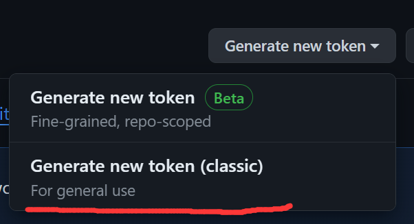
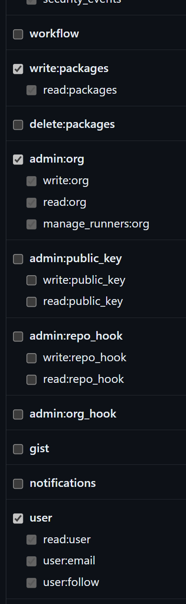

## 当前状态

### 2024.8.13

因为大部分学校已经更换新版本api，所以我决定停止维护。

### 2024.5.8

仓库只在周三中午到次日下午开放，其他时间都是私有的，但是你可以克隆到你的仓库中，然后在你的仓库中进行修改，这样你就可以随时随地的使用了。

周三可以跳过下面配置token的步骤，直接克隆。

玛的被省团委逮到了，所以这个项目暂时停止维护，等我熬过这段时间再说吧。别问我为什么不删，我就是不删。
## 免责声明!!!!!!!!!!!!!!!!!!!!!!!!!!!!!!!!!!!!!!!!!!!!!!!!!!

本项目仅供学习交流使用，请勿用于商业用途，否则后果自负。

## 介绍
这是一个用于自动加入活动的脚本，可以自动加入你收藏的活动、你部落的活动、所有可以加入的活动。并且支持推送功能，可以通过邮件等方式推送活动信息。也可以根据你的要求自定义活动的筛选条件。
pu-client库[pu-client](https://github.com/seiuna/pukoudai-client)。
## 快速开始

### *使用Termux*(linux类似)

#### 安装[Termux](https://github.com/termux/termux-app/releases)

下载arm64版本的安装包，在手机上安装后打开Termux，依次运行以下命令：
```bash
pkg install git
pkg install nodejs
```

#### 检查是否安装成功

```bash
git --version
node -v
```

#### 下载

```bash
git clone https://github.com/pu-client/oyasumi.git
```

1. 第一次克隆将会提示失败并且要求你输入用户名和密码，这是因为你没有配置github的token。
2. 请访问[这里](https://github.com/settings/tokens)创建一个新的token，勾选`admin:org` `read:packages`  `user`权限。
   
3. 然后在Termux中 依次输入你的用户名和token。
至此你已经成功的配置了你的github账户。

再次运行

```bash
git clone https://github.com/pu-client/oyasumi.git
```

#### 进入目录

```bash
cd oyausmi
```

#### 在安装依赖之前

1. 命令行输入 ```bash npm login --scope=@pu-client --auth-type=legacy --registry=https://npm.pkg.github.com ```
   ，回车，根据提示登录github
2. ```bash
   npm login --scope=@pu-client --auth-type=legacy --registry=https://npm.pkg.github.com
    UserName: # 你的github账号
    Password: # 之前登录的token
    ```
#### 安装依赖

```bash
npm install
```

#### 运行

```bash
npm run dev
```

#### 切换账户或者重新登录

```bash
npm run login
```


### 注意事项

1. 不要将termux放到后台，否则可能会导致程序无法正常运行。

# 配置文件

### 配置邮箱推送

文件 `config.json` 中的 `pushing` 配置项可以配置是否启用推送，以及推送的类型。
文件 `push.json` 中的 `email` 配置项可以配置邮箱推送的相关信息。

```json
{
   "pushing": {
      "enable": true,
      "type": "email"
      // email 邮箱推送
   }
}
```

注册 [outlook](https://outlook.live.com/owa/)。

```json
{
   "email": {
      "email": "你的邮箱",
      "password": "密码",
      "host": "smtp-mail.outlook.com",
      //建议outlook 邮箱
      "port": 587,
      "to": "发给谁?",
      "cc": [
         "发给谁?但是别人知道我也发给了他"
      ],
      "bcc": [
         "发给谁?但是别人不知道我也发给了他"
      ]
   },
   "server_chan": {
      "sendKey": ""
   }
}
```


### 修改活动筛选条件

建议配置event.json文件，否则可能会加入奇怪的活动。例如如下配置，只会加入电子信息工程学院学生会、图书馆、轨道交通学生会、人文艺术系的活动。

```json
{
  "filter": [
    {
      "name": "default",
      "start": "00:00",
      "end": "23:59",
      "groups": [
        "电子信息工程学院学生会",
        "图书馆",
        "轨道交通学生会",
        "人文艺术系"
      ],
      "names": [
        ".*"
      ],
      "over": false,
      "score": 0,
      "enable": true
    }
  ]
}
```
### 修改扫描间隔

你可以修改`src/app.ts`文件中的`task_update`、`task_pushing`、`task_keeper`、`task_joining`、`task_monitor`的时间间隔，以适应你的需求。

```js
task_update = scheduleJob('* * */0 * * *', update.bind(client));
// 扫描活动的间隔
task_pushing = scheduleJob('*/1 * * * *', pushing.bind(client));
// 保证你一直处于登录状态
task_keeper = scheduleJob('*/8 * * * * *', keeper.bind(client));
// 加入活动的扫描间隔
task_joining = setInterval(joining.bind(client), 200);
// 当一个活动满员了的扫描间隔
task_monitor = setInterval(monitor.bind(client), 200);
```

配置文件位于`/config`目录下，包含`user.json`、`config.json`、`event.json`三个文件。
### user.json
```json
{
    "username": "",
    "password": "",
    "school": ""
}
```

| 属性       | 类型     | 描述  |
|----------|--------|-----|
| username | string | 用户名 |
| password | string | 密码  |
| school   | string | 学校  |

### config.json
```json
{
  "event":{
    "group":false,
    "fav":true,
    "allowed":true
  },
  "pushing":{
    "enable":false,
    "type":"email"
  }
}
```

| 属性             | 类型      | 描述                |
|----------------|---------|-------------------|
| event.group    | boolean | 是否只加入你自己部落的活动     |
| event.fav      | boolean | 是否自动加入你收藏的活动  未实现 |
| event.allowed  | boolean | 是否自动加入所有可以加入的活动   |
| pushing.enable | boolean | 是否启用推送            |
| pushing.type   | string  | 推送类型（email）       |

### event
```json
{
  "filter":[
    {
      "name":"default",
      "start":"00:00",
      "end":"23:59",
      "groups":[],
      "over":false,
      "score":0,
      "enable":true
    }
  ]
}
```

| 属性            | 类型      | 描述                |
|---------------|---------|-------------------|
| filter.name   | string  | 活动名称              |
| filter.start  | string  | 活动开始时间            |
| filter.end    | string  | 活动结束时间            |
| filter.over   | boolean | 活动时间与设置的时间是否可以有交叉 |
| filter.groups | array   | 只添加指定部落的活动        |
| filter.score  | number  | 只添加分数大于所设置值的活动    |
| filter.enable | boolean | 是否启用              |

